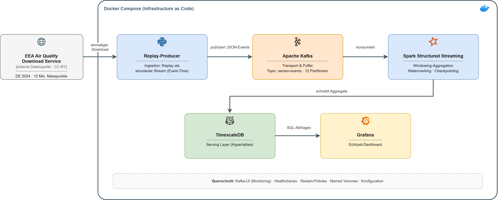

# DLMDWWDE02: Streaming backend for air quality reporting

IU portfolio project (module "Projekt: Data Engineering", task 2).
Replays air quality measurements as a stream and serves windowed aggregates
for reporting.

replay producer -> Kafka -> Spark Structured Streaming -> TimescaleDB -> Grafana

(Concept sketch, German labels; the preprocess step is not drawn.)

## Data

EEA air quality, dataset E1a (validated hourly values), Germany 2024, NO2,
O3, PM10, PM2.5: 1,380 series, ~12.1M rows. Source:
[EEA download service](https://eeadmz1-downloads-webapp.azurewebsites.net),
© [European Environment Agency](https://www.eea.europa.eu/),
[CC BY 4.0](https://creativecommons.org/licenses/by/4.0/).

The downloader tries the EEA API, then the EEA blob container, then a mirror
on this repo's GitHub release. `data/sample/` has 4 Berlin stations (~3 MB)
for a run without download.

## Quick start

    cp .env.example .env
    docker compose run --rm downloader     # skip with DATA_DIR=./data/sample
    docker compose run --rm preprocess     # -> data/replay/events.parquet
    docker compose up -d

| service     | URL                    |
|-------------|------------------------|
| Grafana     | http://localhost:3000  |
| Kafka-UI    | http://localhost:8080  |
| TimescaleDB | localhost:5432, db `airquality` |
| Kafka       | localhost:29092        |

All ports are bound to 127.0.0.1 and can be changed in `.env`.

## Pipeline

- **Producer** (`producer/`): one JSON event per measurement, key = station
  id, `acks=all`. Replay speed `REPLAY_SPEED` (default 1440 = one day per
  minute, 2024 in ~6 h). Sends only `Validity = 1`, converts UTC+1 to UTC.
  `LATE_EVENT_RATE` delays a share of events by 1-4 h. Runs once; exits if
  the topic is not empty.
- **Kafka**: topic `sensor-events`, 12 partitions, created by `kafka-init`
  (auto-create off).
- **Processor** (`processor/`): `from_json` against a fixed schema, drops
  malformed events and events dated in the future, 3 h watermark, output
  mode `update`, one checkpoint per query:

  | query         | window                          | pollutants  | table             |
  |---------------|---------------------------------|-------------|-------------------|
  | `tumbling_6h` | 6 h tumbling, avg/min/max/count | all         | `agg_tumbling_6h` |
  | `sliding_24h` | 24 h, slide 1 h, avg/count      | PM10, PM2.5 | `agg_sliding_24h` |

  The 24 h window matches the daily mean of the PM limit values.
- **Sink**: `foreachBatch`, COPY into a temp table, `INSERT ... ON CONFLICT
  DO UPDATE`. At-least-once plus idempotent upsert: a batch re-run after a
  crash overwrites its own rows.
- **TimescaleDB**: two hypertables, monthly chunks, 3-year retention
  (the data is from 2024).
- **Grafana**: provisioned datasource (read-only role) and dashboard, fixed
  to 2024, anonymous view.

Per batch log line:

    query=tumbling_6h batch=41 input=5036 invalid=0 dropped_late=0 state_rows=2618 watermark=2024-01-12T19:00:00.000Z rate=1296/s ms=3776
    sink=agg_tumbling_6h batch=41 rows=2580 compute_ms=3400 db_ms=60

`dropped_late` counts aggregated groups, not events. The watermark moves
only between batches, so at default settings events are dropped only after
~7 h delay.

Latency: new data reaches the tables within one trigger (10 s) plus batch
time (3.5-6 s), i.e. under 20 s.

## Scaling

- Kafka: 12 partitions allow up to 12 parallel consumers/tasks. The station
  key keeps per-station order. Production: 3 brokers, replication factor 3.
- Spark: runs `local[2]` in one container; the same job runs on a cluster
  by changing `--master`. `maxOffsetsPerTrigger` caps batch size.
- TimescaleDB: time-partitioned chunks; the upsert key is the primary key.
- Measured on one laptop: ~1,300-1,500 events/s per query, full year
  without backlog at the default replay speed.

## Operations

- Healthchecks and memory limits on all long-running services,
  `restart: unless-stopped`. Producer, `kafka-init`, downloader and
  preprocess are one-shot.
- `docker compose down -v` resets Kafka, checkpoints and database. Needed
  after changing a query.
- Spark 4.1.3 instead of 4.1.2 (concept): 4.1.2 hits SPARK-55271 when a
  batch is re-run after a crash.
- Kill tests: `docs/kill-tests.md`. Governance, roles, retention:
  `docs/governance.md`.

## Tests

    docker compose run --rm tests

Unit tests (producer, preprocess, Spark logic) need no running stack.
`tests/test_e2e.py` checks topic, tables and Grafana of the running stack
and skips without Kafka. With the sample:

    DATA_DIR=./data/sample docker compose run --rm preprocess
    DATA_DIR=./data/sample REPLAY_SPEED=1000000 docker compose up -d
    docker compose run --rm tests

## Troubleshooting

- Memory: stack uses ~3 GB; give WSL2 at least 8 GB (`.wslconfig`).
- Port in use: change it in `.env`.
- Producer exits "already holds ... messages": `docker compose down -v`.
- Processor restarts after a code change: old checkpoint, `down -v`.
- Dashboard change not visible: `docker compose restart grafana`.
- Git Bash: prefix `docker compose exec` with `MSYS_NO_PATHCONV=1`.

## Layout

    downloader/  preprocess/  producer/  processor/
    db/          schema and roles
    grafana/     datasource and dashboard
    tests/       pytest
    docs/        architecture, governance, kill tests

Requires Docker Desktop (developed on Windows 11 / WSL2).
